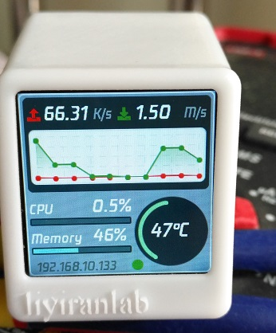
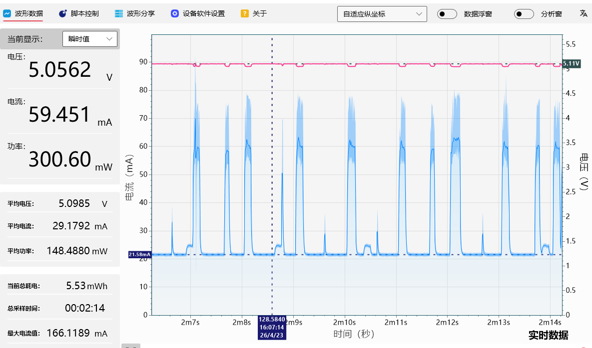
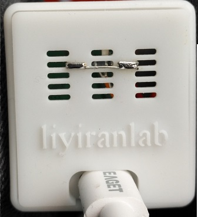

# 路由监视器 RouterMonitor+
## 前言
>这个项目是改进至https://gitee.com/dannylsl/routermonitor

## 先上图
|RouterMonitor+ |RouterMonitor+Power |
|----|  ----  |
|  |  |

# 硬件资料

由于最初对这个功能的定位就是监视屏，也比较了市面上很多开源项目，出于成本考虑选择了SD2小电视的方案
https://oshwhub.com/Q21182889/esp-xiao-dian-shi

## 其他参考开源项目

- **Weather GSM** https://oshwhub.com/yeshengchengxuyuan/b4b67ab1e8234aeebea054b4eda6f549
- **Peak** https://oshwhub.com/eedadada/chappie_oshw

# 软件
## 数据信息来源 NetData
https://www.netdata.cloud/ 

上图就是我改进后的作品，改进的过程中发现很多问题，下面文章会说明，把SD2小电视的1117LDO改DCDC供电后，优化代码，平均功耗做到148mW左右，即使SD2小电视硬件没有任何改动，用我提供的开源代码也可降低现有功耗的50%。
我的改进主要有两项，1 降低功耗，2 增加深睡眠功能，设定时间区域内：自动关闭，自动开启。
因为这量个要求代码已经被我改的面目全非:
1 代码开篇main.ino增加宏定义，方便快速使用；
2 为了降低功耗，把整个代码改为状态机模式，基本实现全异步，不卡cpu，对比原版固件，原版转圈的加载图会卡住不动；
3 为了降低功耗，优化和NetData软件的通信，进一步降低WIFI通信开销；
4 为了深睡眠，增加深睡眠功能，增加NTP时间服务代码；
5 为了照顾不想改SD2硬件的朋友，增加了深睡眠开关，默认关闭深睡眠；
6 调试完成后，建议大家在所有#define DEBUG_ENABLED全面加英文的 // 关闭串口调试功能使用。

正文：
1 首先：关于开源安装软件和使用代码部分参考我提供的开源链接 RouterMonitor，这里是刷固件的方法；
2 我的代码设置方法和原版稍有不同，我的基本全都放到main.ino开始部分宏定义，方便大家设置；
3 串口调试：建议使用：正点原子串口调试助手，我提供两个压缩文件，一个是我改后的源代码，波特率921600，在platformio.ini配置文件中可以看到，一个是，深睡眠调试代码，波特率76800，是ESP8266默认的波特率，方便查看芯片所有信息，方便调试深睡眠和唤醒；
4 下面是我的main.ino开始部分代码，目的就是方便大家修改。

// 功能说明
// wifi连接无阻塞,NTP时间同步无阻塞,屏幕显示无阻塞；
// NTP每2小时与NTP服务器同步一次；
// 添加Deep Sleep功能,在进入规定时间段后,关闭屏幕,停止lvgl输出,关闭除了rtc外的一切功能,进入深睡眠;
// 深睡眠定义时间段精确到分钟;
// 深睡眠过程中不需要联网时尽量保持屏幕关闭,过了设定时间段立即恢复功能;
// 如果不是通过RTC唤醒的情况（比如断电后来电）,如果还在规定深睡眠时间段内,迟5分钟在运行进入深睡眠程序;
// 🟢注意:(如果不断电,只通过reset pin复位（比如串口）,仍然不会开启屏幕,会根据RTC中的数据判断是否再次进入深睡眠)
// 这5分钟所有功能正常运行,屏幕正常输出,如果加上5分钟超过了深睡眠设定时间则不进入深睡眠,
// 由于8266定时精度有误差,深睡眠前半小时强制同步NTP时间一次,尽可能精确的进入深睡眠,
// 进入深睡眠时的定时长度=当前需要睡眠的时长-(当前需要睡眠的时长*2%),
// 注意只在每次NTP同步后确定睡眠多久时减一次2%，排除8266RTC计时长度可能不够导致的多次唤醒中不联网的情况下补偿
// 让8266可以提前醒过来校对时间,尽可能能精确的唤醒，
// 设备后续的DeviceState状态切换先判断NTP是否同步成功，否则跳过DeviceState状态切换

// #define DEBUG_ENABLED        // 串口查看基本信息可能刷屏
// #define DEBUG_ENABLED_0      // 串口查看基本信息可能刷屏
// #define DEBUG_ENABLED_TIME   // 串口查看时间相关信息
// #define DEBUG_ENABLED_RAM    // 串口查看Task_cb中内存占用情况
// #define DEBUG_ENABLED_CPU    // 串口查看loop中cpu占用率
// #define DEBUG_ENABLED_DATA   // 串口查看获取NetData的数据
// #define DEBUG_ENABLED_WIFI   // 取消注释以启用WiFi调试信息

// 🟢 可修改区域：
const char *ssid = "AX";         // 连接WiFi名（此处使用AX为示例）
                                   // 请将您需要连接的WiFi名填入引号中
const char *password = "12345678"; // 连接WiFi密码（此处使用12345678为示例）
// NetData服务器配置
#define NETDATA_SERVER_IP "192.168.10.1"  // 定义被监控的NetData服务器地址
#define NETDATA_SERVER_PORT 19999         // NetData服务器端口
//修改数据获取接口的相关用AI搜索相关代码
//下面是路由器cpu温度接口关键词
#define CHART_NET_RX      "net.wan"
#define CHART_NET_TX      "net.wan"
#define CHART_CPU         "system.cpu"
#define CHART_MEM         "mem.available"
#define CHART_TEMP        "sensors.temp_thermal_zone0_thermal_thermal_zone0_thermal_zone0"
// 维度过滤数据方向
#define DIM_RX            "received"
#define DIM_TX            "sent"
// 被监控的路由器Ram大小单位MB
#define CHART_MEM_X   1024.0

// 深睡眠总开关：true 启用深睡眠功能，false 完全禁用深睡眠
#define DEEP_SLEEP_ENABLED true
// 深睡眠时间段（24h制,精确到分钟） 定时
constexpr uint8_t SLEEP_START_HOUR = 21; // 开始：21:20
constexpr uint8_t SLEEP_START_MIN = 20;
constexpr uint8_t SLEEP_END_HOUR = 07;   // 结束：07:20
constexpr uint8_t SLEEP_END_MIN = 20;

本帖隐藏的内容
我的修改后的源码：

D:\routermonitor-master\images

百度分享更完整：

通过网盘分享的文件：RouterMonitor+
链接: https://pan.baidu.com/s/1gsRqUBNt8IX4nI2scaF0vg?pwd=nvvt 提取码: nvvt

下面分析一下我改代码中遇到的问题：
1 如果不想硬改，要注意网上有两种SD2小电视，有USB转串口芯片原版，可以用usb数据线直接下载固件和不带串口芯片的改版，需要买支持ESP8266的下载板，或自己找网上图片焊接下载板三极管部分加串口工具下载程序；
2 对于原版，一般屏幕是直接焊接的，如果改DCDC供电，频繁翻动主板，容易动到屏幕焊接的排线，容易弄坏屏幕排线，解决办法，可以用高温胶带缠住屏线和PCB焊接部分，防止直接受力到焊接处的软排线；
3 部分改版SD2没有USB转TTL芯片，但是却有屏软排线接口，可轻松拆下屏幕，方便改PCB；
4 对于有串口芯片的SD2，为了降低功耗，可以断开CH430芯片的负极，用电烙铁翘起来，用两条细线焊接一个开关，要写程序时候闭合，不写固件时候断开，节约功耗，注意，两条细线的焊接点是翘起的芯片GND引脚和被翘起的引脚下方焊盘，这样可避免芯片收到干扰产生误码，可保证波特率不变；开关可以用：七脚拨动开关MSK-12C02-07侧拨1P2T滑动2.5mm 白柄 MK-12C02-G025，焊接开关位置选择第二个槽，如果开关放第三个槽，在第一个槽拨动开关，力臂太长容易损坏开关；

|RouterMonitor+b |
|----|
|  |

5 要启用深睡眠要满足两个条件，1 ESP8266芯片是正版，原因是许多盗版低价模块的flash芯片和ESP8266的协议不兼容，导致深睡眠无法唤醒，解决办法:有的可以尝试加上啦电阻，有的必须换flash芯片；
6 要启用深睡眠要满足第2个条件，2 ESP8266深睡眠唤醒是通过GPIO16引脚去拉低EXT_RSTB复位脚，复位后主程序判断RTC模块中的数据，进行下一步操作；SD2小电视没有这方面的电路，使用要用一颗低功耗二极管（可以是4148）连接GPIO16引脚和EXT_RSTB复位脚，二极管上的箭头指向GPIO16引脚；
7 正是因为8266的深睡眠机制导致，深睡眠调试时候，如果RTC中的数据还在深睡眠区，通过串口调试助手复位后，屏幕仍然不能点亮，需要彻底断电，我改DCDC供电，DCDC的输入输出分别加了个2200uf 6.3V的大电解电容，导致彻底断掉会等很久，特别是RTC又非常节能，但是我还是建议大家加上大电容，有利于深睡眠时候DCDC模块的功耗降低；
8 关于ESP8266连接WIFI时，降低功耗要注意的问题，发现ESP8266连接带WIFI时候的主路由，或二级路由，8266的功耗最低，但是也建议开启WIFI客户端隔离，等隔离功能，目的是降低8266和wifi的通讯数据，比如广播等等没有必要的通信；
9 关于ESP8266连接WIFI时，wifi桥接时候功耗较高的解决办法，开启2.4gwifi的，WIFI客户端隔离，隔离网桥端口，组播转单播，DTIM 间隔设置为5解决，我的图片是桥接模式时候测试的功率；
10 对于高通的开源wifi，比如IPQ6000，8266会5min掉线，可以通过修改 非活动站点限制 为3600，降低8266掉线的频率；
11 有的SD2小电视，屏幕上面有条黑线，因为屏幕比标准版好，所以比较厚，可以自己用小刀慢慢刮外壳里面的小槽，让屏幕可以完全放进去，也可以去嘉立创开源平台找厚槽开源摸具免费3D打印；
12 关于我分享的开源代码，除RouterMonitor+源码外，还有个test项目，是专门用来测试，你的小电视是否可以正常深睡眠和唤醒，这个代码屏幕没有显示，通过串口可以查看，是个循环深睡眠和唤醒程序，可以比较快速的测试你的硬件是否深睡眠和唤醒稳定。

